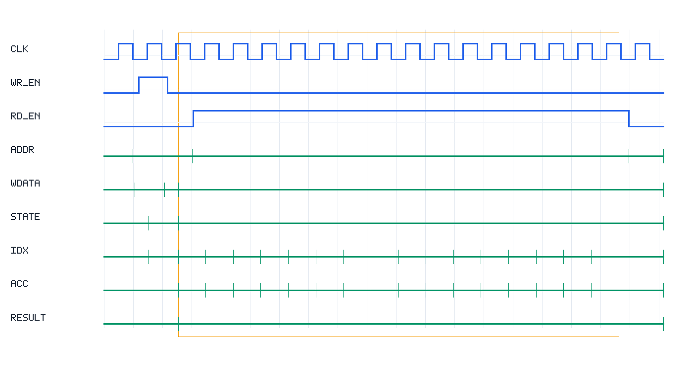

# MMIO Dot-Product Accelerator

A simulation-only SystemVerilog accelerator that computes a signed 16-element dot product through a small memory-mapped I/O interface. The verification environment includes both a SystemVerilog testbench and a C++/Verilator harness that act like firmware: write input vectors into MMIO registers, write `CTRL.START`, poll `STATUS.DONE`, read the 64-bit result, and check it against a software reference model.



The waveform preview shows the all-ones test case: an MMIO start pulse, the 16-cycle RUN window, accumulator/index progression, and final result latch.

## Architecture

```
+-----------------------------+
| Testbench / firmware model  |
|                             |
| mmio_write(addr, data)      |
| mmio_read(addr)             |
+--------------+--------------+
               |
               | Simple 32-bit MMIO bus
               v
+-----------------------------+
| Dot Product Accelerator     |
|                             |
| CTRL / STATUS / RESULT      |
| A[0..15], B[0..15]          |
| IDLE -> RUN -> DONE FSM     |
| signed 32x32 multiplier     |
| signed 64-bit accumulator   |
+-----------------------------+
```

The RTL uses one signed multiplier and one signed 64-bit accumulator. It processes one vector element per cycle, so the measured latency is 17 cycles from the START write being issued to DONE being observed.

## Register Map

| Offset | Name | Access | Description |
| --- | --- | --- | --- |
| `0x00` | `CTRL` | W | Bit 0 starts a computation |
| `0x04` | `STATUS` | R | Bit 0 `DONE`, bit 1 `BUSY` |
| `0x08` | `RESULT_LO` | R | Lower 32 bits of signed 64-bit result |
| `0x0C` | `RESULT_HI` | R | Upper 32 bits of signed 64-bit result |
| `0x10`-`0x4C` | `A[0]`-`A[15]` | R/W | Signed 32-bit input vector A |
| `0x50`-`0x8C` | `B[0]`-`B[15]` | R/W | Signed 32-bit input vector B |

Full details are in [docs/register_map.md](docs/register_map.md).

## Quick Start

Install the tools:

```bash
# macOS
brew install icarus-verilog verilator gtkwave make

# Ubuntu/Debian
sudo apt update
sudo apt install iverilog verilator gtkwave make
```

Run the SystemVerilog/Icarus regression:

```bash
make sim
```

Run the C++/Verilator regression:

```bash
make sim-cpp
```

Open the generated waveform:

```bash
make wave
make wave-cpp
```

Clean generated files:

```bash
make clean
```

## Verification Summary

`make sim` and `make sim-cpp` each run a self-checking regression:

| Test Group | Count | Result |
| --- | ---: | --- |
| Deterministic tests | 6 | 6 PASS |
| Random signed tests | 100 | 100 PASS |
| Total | 106 | 106 PASS |

Deterministic coverage includes all zeros, all ones, increasing values, mixed signs, alternating signs, and a valid 64-bit accumulation stress case:

```text
16 * 1_000_000 * 1_000_000 = 16_000_000_000_000
```

Random tests use signed values in the range `[-1000, 1000]` and compare every hardware result with the software reference.

## Project Structure

```text
mmio-dot-product-accelerator/
  README.md
  Makefile
  rtl/
    dot_accel.sv
  tb/
    dot_accel_tb.sv
  sim/
    sim_main.cpp
  docs/
    architecture.md
    register_map.md
    verification_plan.md
    waveform_walkthrough.md
    results.md
  waves/
    .gitkeep
  screenshots/
    .gitkeep
    waveform_basic_test.png
```

## Documentation

- [Architecture](docs/architecture.md)
- [Register map](docs/register_map.md)
- [Verification plan](docs/verification_plan.md)
- [Results](docs/results.md)
- [Waveform walkthrough](docs/waveform_walkthrough.md)

## What This Demonstrates

- A CPU-style control flow over MMIO registers.
- A hardware/software boundary with explicit data movement and status polling.
- Signed arithmetic in RTL with a 64-bit accumulated result.
- A self-checking verification environment with deterministic and randomized tests.
- Both RTL-native and software-driven verification flows.
- Waveform-level debugging of reset, register writes, START, RUN, DONE, and result reads.

## Future Work

- Add a `LEN` register for variable-length dot products.
- Add a cycle counter register readable through MMIO.
- Add an AXI-Lite wrapper for FPGA SoC integration.
- Replace the single MAC with a 4-lane parallel datapath.
- Add formal checks for FSM and register-map behavior.
